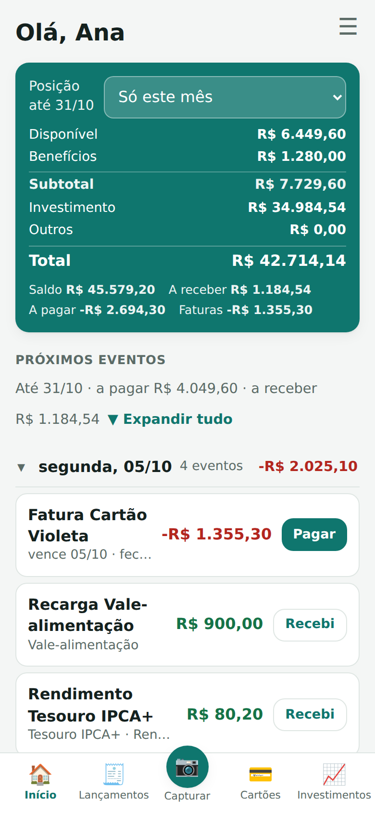
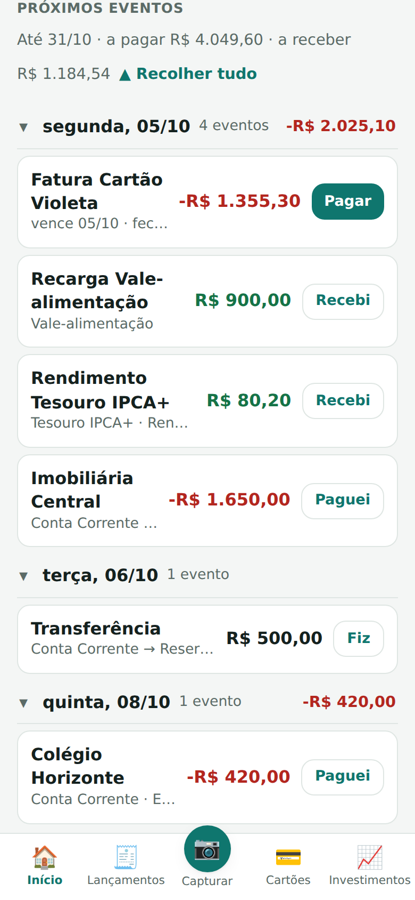
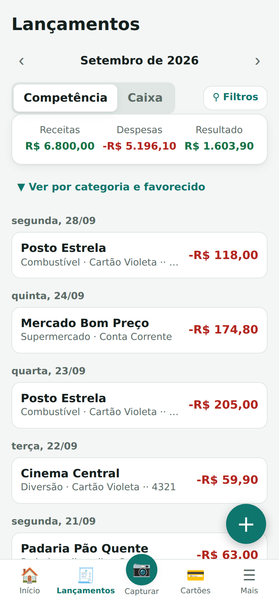
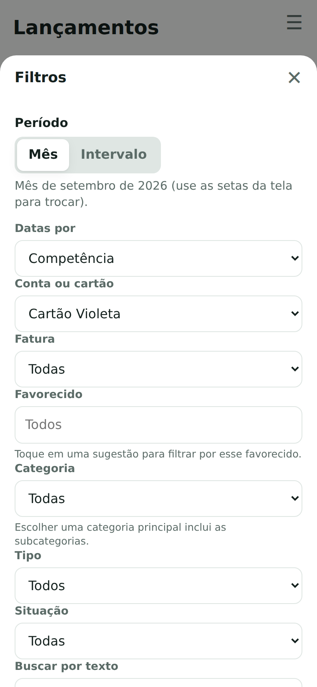
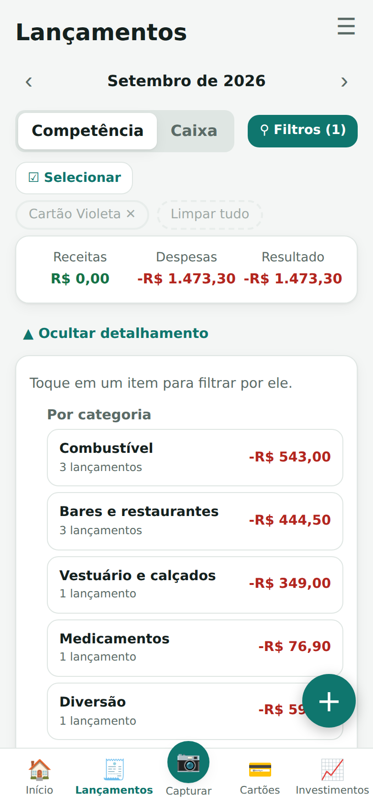
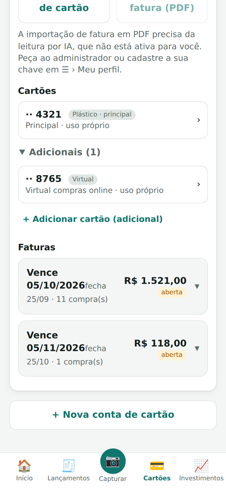
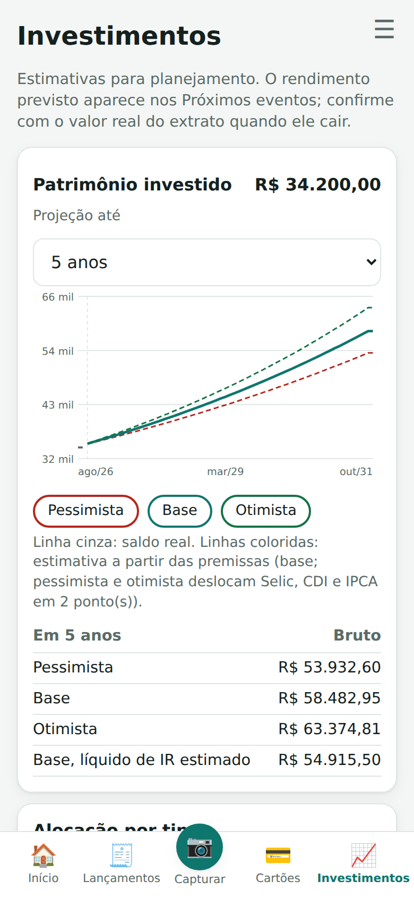
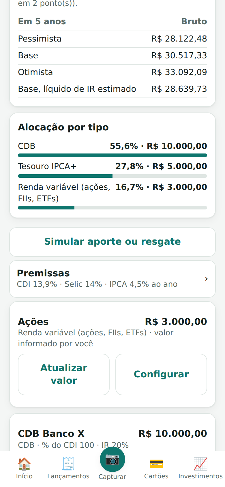

# Finanças

[Português (Brasil)](README.md) · [Português (Portugal)](README.pt-PT.md) · **English**

A **self-hosted** personal and family finance app: you install it on your own computer or server, your data stays with you, and several people can use it with real privacy. It runs in the browser and can be installed on a phone as an app (PWA).

## Install in 3 steps

All you need is **Docker** with Compose (Docker Desktop on Windows and macOS; Docker Engine on Linux).

**1. Download the template file.** Create a folder and save the [`docker-compose.yml`](https://raw.githubusercontent.com/andregoncalvespires/financas/main/docker-compose.yml) in it. In a terminal:

```bash
mkdir financas && cd financas
curl -fsSLO https://raw.githubusercontent.com/andregoncalvespires/financas/main/docker-compose.yml
```

**2. Fill in two lines.** Open `docker-compose.yml` in a text editor and, in the "EDITE AQUI" (edit here) block at the top, fill in `SMTP_USER` (your e-mail address) and `SMTP_PASSWORD` (that e-mail's password). The app sends its sign-in codes through this e-mail account.

<details>
<summary><b>Using Gmail? How to get the password (1 minute)</b></summary>

1. In your Google account, turn on **2-step verification** (Google Account → Security).
2. Open <https://myaccount.google.com/apppasswords> and create an **app password**. Google shows 16 letters: copy them without the spaces.
3. In `docker-compose.yml`:
   ```yaml
   SMTP_USER: "your.name@gmail.com"
   SMTP_PASSWORD: "abcdefghijklmnop"
   ```
</details>

**3. Start it and open it.**

```bash
docker compose up -d
```

Open <http://localhost:8472>, type your e-mail, enter the code that arrives in your inbox, and you are in. On first run the app generates its internal passwords (database and security) by itself; you do not need to create or write down anything.

To use it from another device on the same network (phone, tablet), open `http://COMPUTER-IP:8472`.

If something does not work, see [Common problems](#common-problems).

## Screenshots

> Prefer a walk-through for people who only use the app? There is a **[user guide in PDF](docs/Guia-do-usuario.pdf)** (in Brazilian Portuguese), with no installation details.

<p align="center">
       
</p>

<sub>Fictional data, for demonstration only.</sub>

## What it does

**Accounts and balances**
- Checking accounts, investments, cash, third-party accounts and **benefit cards** (meal or food vouchers) with an automatic **monthly top-up** you can adjust or turn off. You create your own **account types**.
- **Calculated available balance**: current balance plus what is planned to come in, minus what is planned to go out (bills, credit card statements and planned transfers) over the months you choose (this month only, this and next, 3 or 6 months, always up to the end of a month); the choice is remembered on the device.

**Investments**
- Investment accounts with a **subtype** (savings, Tesouro Selic, Prefixado and IPCA+, CDB, LCI, LCA, LC, LA, debentures, CRI/CRA, fixed-income funds, pension plans and variable income), yield rate, **anniversary day** and **maturity date**.
- The app **estimates the yield** for the coming months (it creates planned income entries on the anniversary day); when the statement arrives you confirm the real value and the following estimates are redone. The screen shows gross and **estimated net** yield (regressive income tax on fixed income; savings, LCI and LCA are exempt).
- **Evolution and scenarios:** the **Investments** tab shows a chart with the real balance of the past months and a projection in three scenarios (base, pessimistic and optimistic, shifting Selic, CDI and IPCA by 2 points), the **allocation by type** and a **simulator** for monthly contributions and withdrawals (on one of your accounts or on a rate you enter).
- **Assumptions** (Selic, CDI, IPCA, TR) are set by you in the Investments tab; nothing is fetched from the internet. Variable income and pension plans are entered as a **value you inform**.
- **Maturity alert** in upcoming events and an **e-mail to the account owner** before it matures (lead time is configurable). Everything is an estimate for planning, not investment advice.

**Transactions**
- Expenses, income and **transfers between accounts** (checking to savings, to cash, and so on), which do not distort the month's income and expenses.
- **Competence date** (the month it belongs to) and **cash date** (when the money moves).
- **Planned or confirmed**: plan future payments and receipts, confirm them when they happen, or move a transaction back to planned if you confirmed it by mistake. Card purchases do not have this option: they go on the statement and only leave your balance when the statement is paid (future instalments are planned automatically).
- **Select several and delete**: in Transactions, the *Select* button lets you tick several rows (or everything in the current filter) and delete them at once, including a whole instalment plan. Whatever cannot be deleted is reported and the rest is deleted.
- On income, the field that names the other party is shown as **Payer** (on expenses, *Payee*).
- **Recurring transactions** (rent, salary, subscriptions): the app automatically creates the planned entries for the current month and the next 5, so they show up in Available and in upcoming events. When you edit or delete you choose the reach: that month only, or it and the following ones (anything already confirmed is never deleted). There are also instalment purchases, payees with a suggested category and a lean chart of categories that you can edit and merge.

**Credit cards**
- Statements with closing and due dates, instalment purchases, and paying a statement from an account.
- **Import the statement PDF** (with or without a password): the app reads the purchases, compares them with what you already entered, shows value differences for you to decide, and only saves after you review. Requires AI reading to be enabled.
  - New instalment purchases can also create the **following instalments as planned** on the right months' statements, without changing the imported statement's total. On the next statement, the planned instalment that matches becomes confirmed.
  - The AI suggests a category for each purchase; if many purchases come back as instalments, the review warns you and leaves the future instalments unticked.
  - The PDF password is used only to open the file and is never stored. Only the card's owner can import.
- Open statements left with no purchases at all (for example after deleting transactions) are removed automatically.
- **Additional and virtual cards**: everyone's purchases land on the owner's statement. A family member invited as a cardholder sees only their own spending.

**Planning**
- **Budget** by category with validity rules: open-ended, for a number of months, for specific months of the year, or an adjustment to a single month.
- **Navigation**: the bottom bar has Home, Transactions, Capture, Cards and Investments; the **More** menu (accounts, categories, recurring entries, invitations, profile) is the ☰ icon at the top right.
- **Home** screen: a summary by groups (available, benefits, investments, others and total) and **upcoming events** (bills to pay and receive, statements and planned transfers), with a button to confirm what has already happened.

**Receipt reading with AI (optional)**
- Take a photo of a receipt, invoice, bank transfer proof or statement and the app suggests the amount, date, merchant and category. You always review before saving.

**Several people, with privacy**
- Each person sees only their own data. You share **account by account** (or a card) with whoever you want, as viewer, editor or manager, and withdraw access at any time.
- **New-account notice:** whenever a new account is created, the administrator e-mail (`ADMIN_EMAIL` in `docker-compose.yml`) gets a message. With `ADMIN_EMAIL` empty, nothing is sent.
- **Administration area** (optional): with `ADMIN_EMAIL` filled in, one specific person sees the list of registered people, last access, and how many accounts and cards each one has. See [Optional settings](#optional-settings).
- **Passwordless** sign-in: a 6-digit code arrives by e-mail and the device is remembered. You can see and revoke connected devices.
- Isolation between people is enforced by the database itself (PostgreSQL row-level security), not only by the application code.

**Your data is yours**
- **Export everything** (an Excel spreadsheet with transactions and statements, plus the receipts) and **delete your own account and all your data** at any time, under More → My profile. The **About** screen shows the version and what is new.

> The app's interface is in Brazilian Portuguese.

## Optional settings

<details>
<summary><b>Another e-mail provider (not Gmail)</b></summary>

Any SMTP server that accepts **user name and password** works (a sending service such as Brevo, Mailgun or Amazon SES, or your own domain's mail server). In `docker-compose.yml`, remove the `#` and adjust `SMTP_HOST`, `SMTP_PORT` (587 = STARTTLS, 465 = SSL) and, if you like, `MAIL_FROM`, using the details your provider shows in its dashboard.
</details>

<details>
<summary><b>Administration area (who signed up and when they last used the app)</b></summary>

Optional and read-only. Fill in `ADMIN_EMAIL: "you@example.com"` in `docker-compose.yml` and run `docker compose up -d`. Whoever signs in with that e-mail sees **More › Administration**: the list of registered people, sign-up date, last access, and how many active accounts and cards each one owns (only the ones they own), how many **AI readings** they made (total and in the last 30 days) and their **monthly average of entries** created (last 3 months, not counting automatically generated ones). These are counts only: the area **does not show transactions, amounts or account names**. With `ADMIN_EMAIL` empty (the default) the area does not exist for anyone.
</details>

<details>
<summary><b>Receipt reading with AI (Google Gemini)</b></summary>

Entirely optional: without a key everything works, only automatic reading is off and you enter transactions by hand (the receipt photo is still saved; importing a statement PDF, which depends on AI, is unavailable).

**Who can use AI:** everyone starts **without** AI reading. There are two ways, and neither needs another edit to `docker-compose.yml`:
- **Server AI** (the `GEMINI_API_KEY` below): the administrator (`ADMIN_EMAIL`) turns it on person by person in **More › Administration**. The administrator can always use it. The `CAPTURAS_POR_DIA` limit applies only to this key.
- **Own key:** a person adds their own Google key in **More › My profile › AI reading** (the app tests the key when saving). It is stored **encrypted**, only that person uses it and it is never sent back to the screen. With an own key there is **no daily limit**, and the cost is theirs.

The administration area shows, per person, AI readings (total, last 30 days and how many used the server key), whether there is an own key, and the button to turn server AI on or off. When you update to this version, **everyone (except the administrator) has server AI turned off**; turn it on for whoever you want.

1. Create a key at <https://aistudio.google.com/apikey>.
2. **Enable billing** on the Google project that owns the key. Under Google's terms, content sent with a key that has no billing (the free tier) may be used to improve their products; with billing enabled, it is not. Check the current terms before using real data.
3. In `docker-compose.yml`, fill in `GEMINI_API_KEY: "your-key"` and run `docker compose up -d`.

**What is sent to Google:** only the receipt's image or PDF (or the card statement, already opened on your server; the password is neither sent nor stored) and the app's list of categories, so the AI can pick one. Balances, accounts, names and your other transactions are **not** sent. The key stays on the server only.

**How it works:** the AI returns a *suggestion*; you check it, fix it if needed and only then save it. `CAPTURAS_POR_DIA` (default 30) limits the daily use of people on the server key and controls cost.
</details>

<details>
<summary><b>Reaching it away from home, and installing on a phone</b></summary>

The app works on any network where the computer is reachable; it does not depend on any external service. **How to expose it to the internet is your choice** (VPN, tunnel, reverse proxy with HTTPS, whatever you prefer).

- To **install on a phone** as an app, the browser requires HTTPS (or `localhost`). Without HTTPS you can still use the app normally in the browser.
- With HTTPS the app marks the sign-in cookie as secure automatically. Set `APP_URL` to the public address so the links in invitation e-mails work.
- If you use a proxy, forward to port 8472 and send the `X-Forwarded-For` and `X-Forwarded-Proto` headers. Example with Caddy (gets its own certificate): `financas.yourdomain.com { reverse_proxy 127.0.0.1:8472 }`.
- To accept connections only from the computer itself (for example behind a local proxy), replace the `"8472:8472"` line with `"127.0.0.1:8472:8472"` in `docker-compose.yml`.

> **Warning:** anyone who can reach the address can create an account (they just need to receive the code by e-mail), and the app sends those e-mails through your SMTP account. So keep the app on your local network or protect external access. The app limits code and invitation requests per person, but that is not a substitute for protection.
</details>

<details>
<summary><b>Backup and restore</b></summary>

Your data lives in Docker volumes (`pgdata`, the database, and `dados`, the receipts). They **survive** updates and restarts.

> **Never run `docker compose down -v`**: the `-v` deletes the volumes, that is, all your data. To stop the app use `docker compose stop` (or `docker compose down`, without `-v`).

**Take a backup** (on Windows use WSL or Git Bash: PowerShell changes the encoding of the generated files):

```bash
docker compose exec -T db pg_dump -U fin_owner -d financas -Fc > financas-$(date +%F).dump
docker compose exec -T api tar czf - -C /data . > comprovantes-$(date +%F).tgz
```

**Keep those files off the computer** (another disk, cloud). To automate, put both commands in `crontab -e`, with `cd /folder/of/docker-compose &&` in front.

**Restore** (on a new installation, or on the same one after a problem):

```bash
docker compose up -d                  # the app creates the empty structure
docker compose stop api
docker compose exec -T db pg_restore -U fin_owner -d financas --clean --if-exists --no-owner < financas-YYYY-MM-DD.dump
docker compose exec -T api tar xzf - -C /data < comprovantes-YYYY-MM-DD.tgz     # receipts (optional)
docker compose start api
```
</details>

<details>
<summary><b>Updating to a new version</b></summary>

Take a backup (above) and, in the folder with `docker-compose.yml`:

```bash
docker compose pull
docker compose up -d
```

- Your data is not touched. Database changes are applied automatically at startup and **only add things**.
- `docker-compose.yml` uses `:latest`, which always follows the newest release. Before a new major version (2.0, for example), read the [CHANGELOG](CHANGELOG.md): it may require action from you. To pin a version, change it, for example, to `:1.9.0` on the `x-imagem` line.
- Read the [CHANGELOG](CHANGELOG.md) before updating: changes that need action from you are highlighted there. Under More → About the app you can see the version in use and what is new; if the server is newer than the app open on your phone, a button to update appears.
- **Rolling back:** restore the backup you took before and use the previous version. Rolling back only the image, without restoring the database, may not work if the new version changed its structure.
- Avoid automatic update tools (such as Watchtower): database changes happen at startup, and a backup beforehand matters.
</details>

## Common problems

| Symptom | What to do |
|---|---|
| The app does not start (the `api` container keeps restarting) | `docker compose logs api`: the first line says what is left to fill in. |
| The code does not arrive by e-mail | `docker compose logs api` and look for `e-mail enviado` (sent) or `falha ao enviar` (failed). Common causes: wrong app password, 2-step verification off, message in spam. |
| It does not open from another device on the network | Use `http://COMPUTER-IP:8472` and allow port 8472 in the computer's firewall. |
| Port 8472 is already in use | In `docker-compose.yml`, change `"8472:8472"` to `"8080:8472"` and use port 8080. |
| After an update the phone still shows the old screen | More → About the app → update; if it does not show, clear the site's data in the phone's browser once. |
| Receipt reading does not work | Check `GEMINI_API_KEY` and that billing is active on the Google project; the log shows the error returned. |

## Privacy and security

- Your data stays on your server. The only data that leaves it is what you choose to send: the code, invitation and investment-maturity notice e-mails (through your SMTP provider) and, if you turn on AI reading, the receipt image (to Google).
- Each person only sees what is theirs or what has been shared with them, and the database enforces this.
- Secrets (database passwords and the key that protects the codes) are generated automatically and kept in a dedicated Docker volume.
- To report a security issue, see [SECURITY.md](SECURITY.md).

## Removing the installation

To turn the app off while keeping your data: `docker compose down`. To **delete everything permanently** (database, receipts and secrets): `docker compose down -v`. Only do this if you are sure and have a backup stored.

Each person can also delete their own account and data under More → My profile → *Excluir minha conta e todos os meus dados* (delete my account and all my data), confirmed with a code sent to their e-mail. If they own shared accounts or cards, those are deleted for everyone, and the app first warns who will lose access.

## For developers

Stack: Python 3.12 (FastAPI), PostgreSQL 16 with row-level security, a plain JavaScript front end (PWA, no build step). Migrations live in `backend/migrations` and are applied at startup.

```bash
# run from source (builds the image locally)
docker compose -f docker-compose.yml -f docker-compose.build.yml up -d --build

# tests (need a local PostgreSQL with the fin_owner role and the financas_test database; see backend/tests/conftest.py)
cd backend && pip install -r requirements-dev.txt && python -m pytest -q
```

Each release is a `vX.Y.Z` tag (the `VERSION` file must match): when the tag is created, GitHub Actions runs the tests and publishes the image `ghcr.io/andregoncalvespires/financas`.

## License and notice

Distributed under the **GNU Affero General Public License v3.0** ([LICENSE](LICENSE)). In short: you may use, study, modify and share the program; if you offer a modified version as a service to other people over a network, you must make its source code available under the same license. This summary does not replace the license text.

This software is provided **as is**, without warranty, and is not financial advice. Keep backups of your data.
